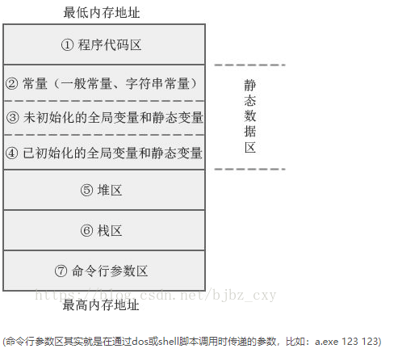

# 面试知识结构

> 后端开发集合：https://cyc2018.github.io/CS-Notes/

## 基础知识

### 语言基础（C/C++)

#### C与C++区别

> 设计思想：C面向过程；C++面向对象
>
> 包含关系：C++是C的超集（看成一个扩展）
>
> 语法特性：C++支持OOP（封装，继承，多态）；GP（template）；异常处理（exception）；安全类型转换(4类cast)

#### static类型及作用

**三作用：限制作用域（本文件/函数）；提升生存期（程序运行期）；保证唯一性**

>变量
>+ 全局
>    + 内存位置：静态存储区
>    + 作用域：本文件内
>    + 生存周期：程序运行周期
>
>+ 局部
>    + 内存位置：静态存储区
>    + 作用域：本函数内
>    + 生存周期：函数结束后不会被销毁，而是无法被访问，下次被调用时继续访问
>+ 类成员（无this）
>  
>    + 类的所有对象共享变量
>    + 先于类存在
>
>函数
>+ 普通函数
>    + 作用域：本文件内
>+ 类函数（无this）
>    + 类可直接引用
>    + 函数内只能直接引用类静态成员，非静态成员必须通过对象来引用

#### 4种cast类型转换

> static_cast
>
> + 静态转换，编译器检查
> + 用于各类隐式转换，如非const转const，void*转指针
> + **不可用于下行转换（不安全）；不可转const和volatile性质**
>
> dynamic_cast（安全）
>
> + 动态转换，运行期检查
> + 仅转换类间层次（指针/引用）
>
> const_cast
>
> + 转换cast，volatile类型（依旧指向原来的对像）
>
> reinterpreter_cast
>
> + 从二进制角度重新解释数据（不常用）
>
> **对比static_cast和dynamic_cast**---类层次转换（基类-子类）
>
> + 上行（子类指针转为基类）：二者均可，因为指针范围缩小
> + 下行（基类指针转为子类）：指针范围扩大，需检测；static_cast没有进行检查，不安全
>
> **使用方式**：const_cast <type_id> (expression)

#### C语言内存模型



+ 代码区：二进制可执行代码
+ 数据区
  + 常量区：字符、数值、字符串、符号常量
  + 全局变量和静态变量
    + 未初始化
    + 已初始化
+ 栈区：局部变量，函数调用
+ 堆区：malloc/new
+ 命令行参数区：在命令行中调用脚本时传入的参数

#### 智能指针

> C++用来管理堆内存的申请释放。
>
> share_ptr：一个对象有多个指针指向它（维护一个计数器，引用+1，销毁-1）
>
> unique_ptr:一个对象仅一个指针指向它
>
> weak_ptr：配合share_ptr使用，仅查看资源

#### sizeof

+ 空struct/class：1B（仅用于标识）
+ 指针：4B（32位机器）
+ 数组/对象：数组/对象占用的实际大小

#### 指针vs引用

> | 类型\对比特征 | 本质区别 | 初始化     | 指NULL | 能改变？ |      | sizeof   |
> | ------------- | -------- | ---------- | ------ | -------- | ---- | -------- |
> | 指针          | 存地址   | 可无       | 可     | 可       | 有   | 4        |
> | 引用          | 变量别名 | 必须用变量 | 否     | 否       | 无   | 对象大小 |
>
> 一句话：引用声明即必须用变量赋值，且之后无法改变（依附性，从一而终）

#### 指针vs数组

|      | 数据存储 | 访问方式         | 使用环境 |
| ---- | -------- | ---------------- | -------- |
| 指针 | 地址     | 间接（*解引用）  | 动态     |
| 数组 | 数据     | 直接（下标索引） | 静态     |

#### 重载vs重写

+ 重载：函数名相同，函数类型或个数不完全相同。
+ 重写：继承中子类重新实现父类的函数。

#### 虚函数/析构函数

> 构造顺序：基类--成员的构造函数--自身构造函数
>
> 析构顺序（相反）

> **Q1: 为什么基类的析构函数必须为虚函数？**
>
> 当基类指针指向子类对象时，释放基类指针可以释放子类对象，防止内存泄漏
>
> **Q2:为什么类的默认析构函数不是虚函数？**
>
> 虚函数需要虚函数表和虚函数指针，可节约空间

#### 虚函数/纯虚函数

+ 形式：虚函数用virtual修饰；纯虚函数=虚函数+`=0`
+ 要求：子类中虚函数选择性实现；纯虚函数必须实现

#### main之前打印

**c**

```cpp
#include<bits/stdc++.h>
using namespace std;
__attribute((constructor)) void before_main()  // 之前打印（构造函数）
{  
    printf("%s\n",__FUNCTION__);  
}
__attribute((destructor)) void after_main() // 之后打印（析构函数）
{
    printf("%s\n", __FUNCTION__);
}
int main() {
    printf("%s\n", __FUNCTION__);
    return 0;
}
```

#### 常量定义存储

> 1、定义：常量定义必须使用编译时可确定的值初始化
>
> 2、存储
>
> + 字面值：常量存储区
>
> + 局部常量：栈
>
> + 全局常量：一般置于符号表提高效率

#### new/malloc

> |             | 类别 | 指定大小 | 调用析构/构造 |
> | ----------- | ---- | -------- | ------------- |
> | new/delete  | C++  | 无需     | 是            |
> | malloc/free | C    | 必须     | 否            |

#### 左值右值引用

> 左值：可取地址，有名字
>
> 右值：不可取地址，无名字（匿名）
>
> 左值引用：可修改，可寻址
>
> 右值引用：不可修改

#### include “” vs <>

> 1、当前头文件目录
>
> 2、编译器指定的头文件路径（-I设置）
>
> 3、系统变量CPLUS_INCLUDE_PATH/C_INCLUDE_PATH指定的路径
>
> 查找顺序不同：
>
> + 双引号：1-2-3
>
> + <>：2-3

#### 拷贝构造相关

+ 浅拷贝：与原有对象指向同一个内存
+ 深拷贝：分配新的内存

>  如何禁止类中的拷贝？

+ 1、用`private`修饰**构造函数**和**赋值操作函数**，并且不实现
+ 2、为了保证安全性，可将二者抽象为一个基类，给需要子类继承
+ 3、C++11可以用在函数声明尾部增加`=delete`关键字

#### 函数指针

```cpp
#include<bits/stdc++.h>
using namespace std;
int f1(int a) {
    cout <<"f1"<<endl;
    return a;
}
int f2(int a) {
    cout <<"f2"<<endl;
    return a;
}
int f3(int a) {
    cout <<"f3"<<endl;
    return a;
}
int main() {
    int (*f[3])(int) = {f1,f2,f3}; // 函数指针数组用法
    cout<<f[0](1)<<endl; // 等价于调用f1(1)
    cout<<f[1](2)<<endl; // 等价于调用f2(2)
    cout<<f[2](3)<<endl; // 等价于调用f3(3)
    return 0;
}
```


### 容器

#### map和set对比及实现

> 实现：map和set均是调用红黑树相关操作实现
>
> 对比：
>
> + map为key-value，而set仅有key
> + 二者key均不可修改，map的value可修改（若可修改，必须先删除再插入，调整后迭代器失效，结构破坏）
> + map支持下标索引，如mp[k],若k不存在，则会默认初始化其value为默认类型

#### stl-allocator

> 作用：封装stl容器的内存管理细节
>
> 组成：
>
> new流程：内存分配（allocate），构造函数（construct）
>
> delete流程：析构函数（destroy)，内存释放（deallocate）
>
> 内存分配策略--两级分配器（减少小内存申请造成内存碎片）
>
> + \>128B：malloc,realloc,free
> + <128B：内存池技术，空闲链表管理

#### erase分析

> 顺序容器（vector）：删除后返回下一个有效Iterator，但删除元素后面的所有元素均前移一位，因此他们的迭代器均失效
>
> 关联容器（map/set）：删除仅令当前元素迭代器失效，不影响其余迭代器，删除时记得记录下一个迭代器
>
> list：以上两种方式均可

## 操作系统

> 《深入理解计算机系统》 **CMU 15-213 CSAPP**
>
> 《Linux内核设计与实现》
>
> 《深入理解linux内核》 ：讲2.6版本的内核
>
> https://www.cnblogs.com/inception6-lxc/p/9073983.html

1. 进程和线程之间的区别
2. 操作系统的调度算法
3. 进程间通信的方式和区别
4. 虚拟内存机制的作用
5. 缓存的作用以及缓存替换算法
6. 线程的实现方式
7. 虚拟文件系统

### 进程和线程

#### 进程与线程对比

进程：资源分配的基本单位。进程控制块PCB描述进程的基本信息和运行状态，对进程的创建撤销均是对PCB操作

线程：独立调度的单位。一个进程有多个线程，共享进程资源

+ 拥有资源

进程是资源分配的基本单位，但线程不拥有资源，只可以访问隶属进程的资源

+ 调度（线程--进程切换）
线程是调度的基本单位。**同一进程**中，线程切换不会引起进程切换；而从一个进程中的线程切换到另一个进程的线程是，会引起进程切换。

+ 系统开销

进程创建，撤销，切换开销大：涉及资源分配，回收，CPU环境保存和设置

线程创建，撤销，切换开销小：只需保存和设置少量寄存器

+ 通信

线程：直接读写同一进程的数据进行通信

进程：IPC

#### 进程状态转换

运行态（running）：通过调度算法得到cpu时间，从就绪态转换而来

就绪态（ready）：进程所需各种资源已满足（除了cpu时间）;

等待态（waiting）：缺少相应资源（除了cpu时间）

**仅仅就绪和运行态双向转换，其余均为单向**

#### 进程通信

**通信vs同步**

> 进程同步：控制多个进程按一定顺序执行
>
> 进程通信：进程间传输信息
>
> 通信是手段；同步是目的。即为了达到能让进程同步的目的，需让进程进行通信，传输一些进程同步所需信息。

##### 管道

###### 1、普通管道PIPE

通过调用pipe函数创建，fd[0]读，fd[1]写

```cpp
#include <unistd.h>
int pipe(int fd[2])
```

限制：

+ 只支持半双工通信（双向交替传输）
+ 只能在父子或兄弟进程通信

###### 2、命名管道FIFO

在无名管道基础上增加的命名管道，增加文件路径与之关联，可以克服匹配只能在父子和兄弟间通信的缺点。

文件名在文件系统；管道位于内存中

知名的FIFO作为客户-服务端间作为汇点，传输数据

##### 系统IPC

###### 1、消息队列

消息的链接表，面向记录，具有优先级，独立于读写进程存在，处理同步问题

根据消息类型有选择的接受

###### 2、信号量

是一个计数器，控制多个进程对共享数据的访问。实现同步和互斥，而非存储通信数据

+ 进程间同步，需结合共享内存实现数据通信
+ PV操作，对信号量的操作均属原子操作
+ PV对信号量的操作每次可增减任意数
+ 支持信号量组

###### 3、信号

比较复杂的通信方式，通知接受进程某个事件已发生

###### 4、共享内存

多个进程共享相同的内存区域。

+ 速度最快的IPC，直接对内存读写
+ 同步：信号量+共享内存

##### 套接字socket

用于不同主机间的进程通讯

#### 线程通信

临界资源：一次仅允许一个进程访问

临界区：访问临界资源的代码块

+ 互斥量：拥有仅存的互斥量才可访问临界资源
+ 信号量：允许多个线程同时访问一资源，但需控制上限
+ 事件：通过通知操作实现多线程同步，便于实现多线程优先级比较

#### 进程调度算法

根据不同环境选择合适的调度算法

##### 批处理系统

目标：无太多用户操作，保证吞吐量和周转时间（提交到终止的时间）

+ 先来先服务（FCFS）：非抢占式调度，先来先服务；对短作业不利，需要等待长作业。
+ 短作业优先（SJF）：非抢占式调度。长作业可能饿死
+ 最短剩余时间优先（SRTN）:SJF的抢占式调度，即按剩余运算时间调度

##### 交互式系统

目标：多用户操作，快速响应

+ 时间片轮转：将所有就绪队列按FCFS排成队列，给队首分配一个cpu时间，执行完回到队尾。
+ 优先级调度：给每个进程分配优先级。防止低优先得不到调度，逐渐增加等待进程的优先级
+ 多级反馈队列：（时间片+优先级）多个队列cpu时间呈递增排列，时间片越小，优先级越高。进程在第一个队列未执行完，进入下一个时间片更长的队列

##### 实时系统

目标：在一个确定的时间内得到响应

+ 硬件实时：绝对截止时间
+ 软件实时：可以容忍一定误差

## 计算机网络

> 《计算机网络原理：自顶向下方法》
>
> 《TCP/IP详解卷1》
>
> 《图解TCP/IP》
>
> 《图解HTTP》
>
> https://blog.csdn.net/justloveyou_/article/details/78303617
>
> https://www.cnblogs.com/inception6-lxc/p/9152691.html
>
> 

**TCP/IP**

 	1.分层模型  

 	2.三次握手、四次挥手原理  

 	3.拥塞控制  

 	4.流量控制与滑动窗口  

 	5.TCP与UDP比较  

 	6.DDos攻击  

 	7.close_wait，time_wait状态原因  

 **HTTP**  

 	1.http/https 1.0、1.1、2.0  

 	2.get/post 以及幂等性  

 	3.http 协议头相关  

 	4.Cookie Session 的比较  

 	5.长连接与短连接，websocket的对比  

 **Socket**  

 	1.IO模型  

 	2.select ，poll，epoll原理和对比

## 数据库

> https://blog.csdn.net/qq_22222499/article/details/79060495
>
> [面试整理](https://blog.csdn.net/qq_39187822/article/details/80431161?ops_request_misc=%7B%22request_id%22:%22158332476119724839244293%22,%22scm%22:%2220140713.130056874..%22%7D&request_id=158332476119724839244293&biz_id=0&utm_source=distribute.pc_search_result.none-task)

**MySQL相关**

 	1.索引：B树、B+树底层结构，索引失效条件 

 	2.sql语法 

 	3.关系型数据库三范式 

 	4.存储引擎：InnoDB和MyISAM对比 

 	5.数据库的锁：行锁，表锁，页级锁，意向锁，读锁，写锁，悲观锁，乐观锁等等 

 	6.数据库隔离级别：脏读、不可重复读、幻读 

 	7.事务的ACID理论 

 	8.查询优化：explain，慢查询，show profile 

 	9.分布式：分库分表，读写分离 

 	**Redis相关**  

 	1.Redis 特点 

 	2.Redis 底层数据结构：跳表，字典 

 	3.数据淘汰策略 

 	4.持久化方式：AOF，RDB 

 	5.哨兵模式 

 	6.集群同步方式

# Linux

## 常用命令

批量改文件名：mv

vi编辑器；多个文件快捷切换？复制一行

内容显示：cat，less，grep过滤，正则查找

目录文件操作

gcc编译链接；makefile


系统编程接口：

文件重定向

进程

线程


[课程网站](https://www.linuxmooc.com/)

参考资料

《鸟叔的linux私房菜》：命令，使用

《Unix环境高级编程》-APUE：编程接口

xv6，ucore

# 简历制作

+ 你是谁

+ 你想做什么

+ 你能做什么

如何让HR对你一见钟情

**内容针对应聘岗位**

第一部分

+ 个人信息
  + 邮箱昵称=姓名+学校
  + 邮件命名标题=姓名+专业+学校+职位+手机号
+ 教育背景：逆序写，最高学历先写；时间精确到月份
  + GPA
  + 主修课程
  + 海外经历
  + 获奖情况
+ 专业技能：分类展示，慎用熟练，精通
+ 求值意向

第二部分

+ 实习项目
  + 条理分明+STAR
+ 校内活动

第三部分

+ 技能证书
+ 